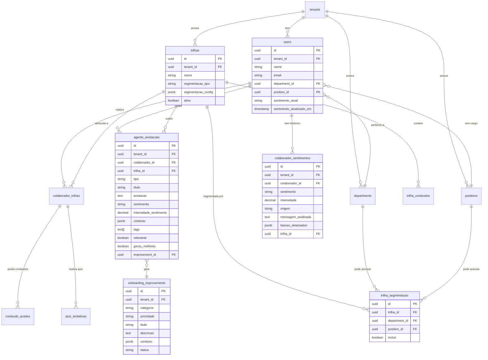
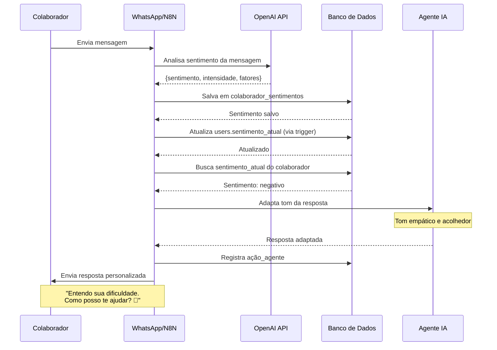
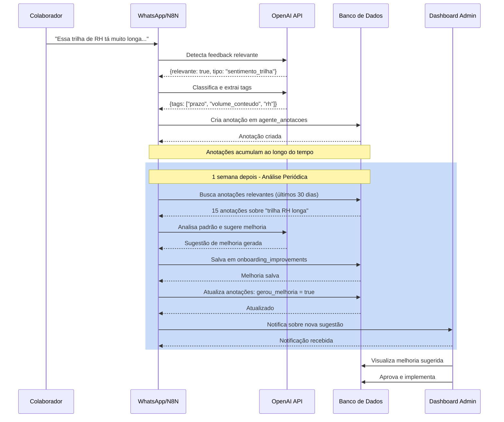
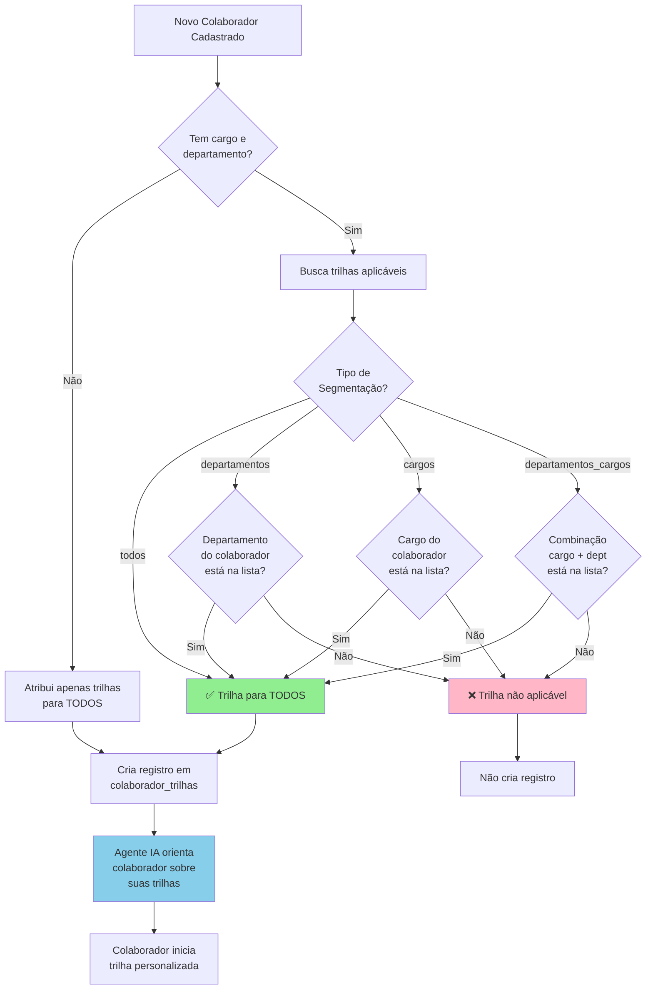
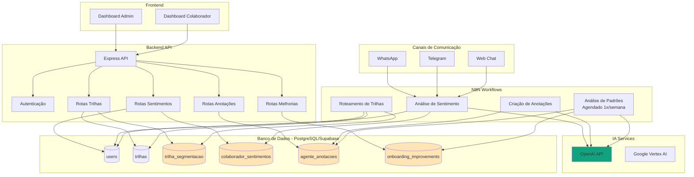
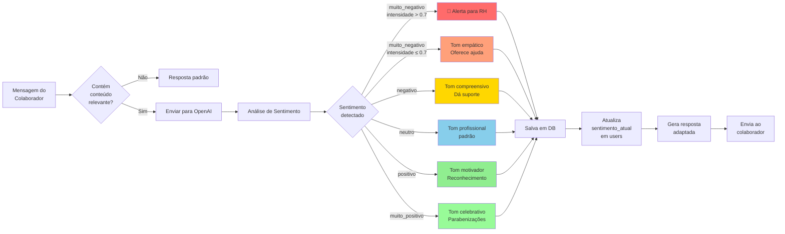
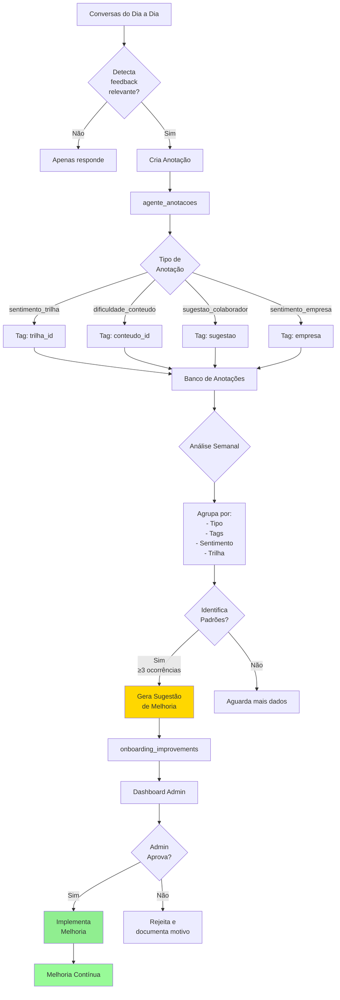
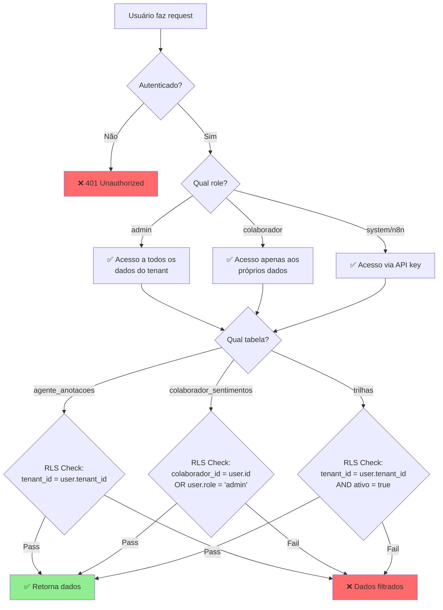

# 📐 Diagramas de Arquitetura - Melhorias Flowly

**Data:** 10 de outubro de 2025

---

## 🗄️ Diagrama de Banco de Dados



---

## 🔄 Fluxo 1: Captura de Sentimento e Adaptação de Resposta



---

## 🔄 Fluxo 2: Criação de Anotação e Geração de Melhoria



---

## 🔄 Fluxo 3: Roteamento de Trilhas por Cargo/Departamento



---

## 🎯 Arquitetura Geral do Sistema



---

## 📊 Fluxo de Análise de Sentimento - Detalhado



---

## 🧠 Sistema de Memória do Agente



---

## 🎨 Interface Admin - Wireframe Conceitual

```
┌─────────────────────────────────────────────────────────────────┐
│ Flowly - Dashboard Admin                              [👤 Admin] │
├─────────────────────────────────────────────────────────────────┤
│                                                                   │
│ ┌─────────────────┐  ┌─────────────────┐  ┌─────────────────┐ │
│ │ 😊 Sentimento    │  │ 📝 Anotações    │  │ 💡 Melhorias     │ │
│ │    Médio         │  │    Relevantes   │  │    Sugeridas     │ │
│ │                  │  │                  │  │                  │ │
│ │    7.8/10        │  │       23        │  │        5         │ │
│ │  (+0.5 vs mês)   │  │  (últimos 7d)   │  │   (pendentes)   │ │
│ └─────────────────┘  └─────────────────┘  └─────────────────┘ │
│                                                                   │
│ ┌───────────────────────────────────────────────────────────┐   │
│ │ 📊 Distribuição de Sentimentos (Últimos 30 dias)          │   │
│ │                                                             │   │
│ │  😄 Muito Positivo  ████████ 35%                          │   │
│ │  🙂 Positivo        ████████████ 40%                      │   │
│ │  😐 Neutro          ████ 15%                              │   │
│ │  😟 Negativo        ██ 8%                                 │   │
│ │  😞 Muito Negativo  █ 2%                                  │   │
│ └───────────────────────────────────────────────────────────┘   │
│                                                                   │
│ ┌───────────────────────────────────────────────────────────┐   │
│ │ 💡 Melhorias Sugeridas pelo Agente                         │   │
│ │                                                             │   │
│ │ 🔴 Alta   │ Dividir trilha de RH em 2 partes              │   │
│ │           │ 📊 Baseado em 8 feedbacks negativos           │   │
│ │           │ [Ver Detalhes] [Aprovar] [Rejeitar]           │   │
│ │                                                             │   │
│ │ 🟡 Média  │ Adicionar vídeos explicativos sobre benefícios│   │
│ │           │ 📊 Baseado em 5 dúvidas recorrentes           │   │
│ │           │ [Ver Detalhes] [Aprovar] [Rejeitar]           │   │
│ └───────────────────────────────────────────────────────────┘   │
│                                                                   │
│ ┌───────────────────────────────────────────────────────────┐   │
│ │ 🚨 Alertas - Colaboradores com Sentimento Muito Negativo   │   │
│ │                                                             │   │
│ │ • João Silva (Dev) - 😞 há 2 dias                         │   │
│ │   Última msg: "Não tá dando certo, muito complicado"      │   │
│ │   [Conversar] [Oferecer Ajuda]                            │   │
│ └───────────────────────────────────────────────────────────┘   │
└─────────────────────────────────────────────────────────────────┘
```

---

## 📱 Experiência do Colaborador - Exemplo de Conversa

```
┌─────────────────────────────────────────────┐
│ 💬 WhatsApp - Flowly Bot                    │
├─────────────────────────────────────────────┤
│                                             │
│ [10:00] Colaborador:                        │
│ Tô com dificuldade nessa trilha de RH      │
│ Tem muito conteúdo pra ler 😕              │
│                                             │
│ [10:01] Flowly Bot:                         │
│ Entendo sua dificuldade, João! 💙          │
│                                             │
│ Sei que pode parecer bastante conteúdo,    │
│ mas vou te ajudar a organizar melhor:      │
│                                             │
│ 📌 Foque primeiro nos 3 primeiros docs     │
│ 📌 Você tem 5 dias ainda, sem pressa!      │
│ 📌 Posso resumir os pontos principais?     │
│                                             │
│ Como posso te ajudar agora? 😊            │
│                                             │
│ [10:02] Colaborador:                        │
│ Sim! Seria ótimo um resumo                 │
│                                             │
│ [10:03] Flowly Bot:                         │
│ Perfeito! Aqui vai um resumo da            │
│ Trilha de RH:                              │
│                                             │
│ ✅ Benefícios: Plano saúde, VR, VT        │
│ ✅ Férias: 30 dias após 1 ano             │
│ ✅ Horário: Flexível, 8h/dia              │
│                                             │
│ Melhorou? 😊                               │
│                                             │
│ [10:04] Colaborador:                        │
│ Muito melhor! Obrigado! 😊                │
│                                             │
│ [10:05] Flowly Bot:                         │
│ Que ótimo! Fico feliz em ajudar! 🎉       │
│ Qualquer dúvida, é só chamar! 💪          │
│                                             │
└─────────────────────────────────────────────┘

🤖 Nos bastidores:
   ✅ Sentimento detectado: negativo → muito_positivo
   ✅ Tom adaptado: empático → celebrativo
   ✅ Anotação criada: "dificuldade_conteudo" na trilha RH
   ✅ Tags: ["volume_conteudo", "rh", "prazo"]
```

---

## 🔐 Segurança e Privacidade - RLS (Row Level Security)



---

**Última atualização:** 10 de outubro de 2025  
**Criado por:** Haendell Lopes + AI Assistant


