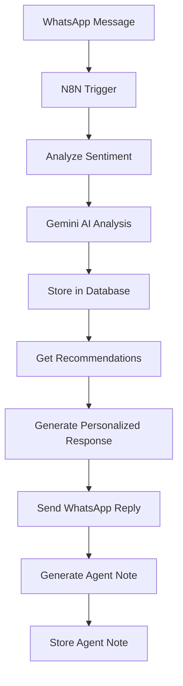

# 🤖 Integração N8N + Google Gemini + Análise de Sentimento

## 📋 **Resumo da Implementação**

Implementamos um sistema completo de análise de sentimento em tempo real que integra:
- **N8N** para orquestração dos workflows
- **Google Gemini** para análise inteligente de sentimento
- **APIs customizadas** para persistência e recomendação
- **Banco de dados** para armazenamento e histórico

---

## 🔧 **Componentes Implementados**

### **1. Backend Services**

#### **GeminiService** (`src/services/geminiService.js`)
```javascript
// Análise de sentimento
const sentiment = await geminiService.analyzeSentiment(message, context);

// Geração de anotações do agente
const note = await geminiService.generateAgentNote(messages, userContext);

// Recomendação de trilhas baseada em sentimento
const recommendation = await geminiService.recommendTracksBySentiment(userSentiment, availableTracks);
```

#### **API Endpoints** (`src/routes/analise-sentimento.js`)
- `POST /api/analise-sentimento` - Analisa sentimento de mensagem
- `POST /api/analise-sentimento/gerar-anotacao` - Gera anotações do agente
- `POST /api/analise-sentimento/recomendar-trilhas` - Recomenda trilhas
- `GET /api/analise-sentimento/historico/:userId` - Histórico de sentimentos

### **2. Workflow N8N**

#### **Fluxo Principal:**
1. **WhatsApp Trigger** → Recebe mensagem
2. **Filter Valid Messages** → Valida tipo de mensagem
3. **Normalize Message Data** → Padroniza dados
4. **Analyze Sentiment (Gemini)** → Analisa sentimento via API
5. **Get Track Recommendations** → Busca trilhas recomendadas
6. **Generate Personalized Response** → Gera resposta personalizada
7. **Send Personalized Response** → Envia resposta via WhatsApp
8. **Generate Agent Note** → Cria anotação para o agente

---

## 🚀 **Configuração e Uso**

### **1. Variáveis de Ambiente**
```bash
# Adicione ao seu .env
GOOGLE_GEMINI_API_KEY=sua_chave_gemini_aqui
```

### **2. Instalação de Dependências**
```bash
npm install @google/generative-ai
```

### **3. Importar Workflow no N8N**
1. Copie o conteúdo de `N8N_WORKFLOW_SENTIMENTO_INTEGRATION.json`
2. No N8N, vá em **Workflows** → **Import from URL/File**
3. Cole o JSON e importe

### **4. Configurar Credenciais**
- **Google Gemini**: Use a mesma credencial existente
- **WhatsApp**: Use a mesma credencial existente
- **APIs**: Configure a URL do seu servidor (localhost:3000 ou produção)

---

## 📊 **Funcionalidades Implementadas**

### **Análise de Sentimento em Tempo Real**
```json
{
  "sentimento": "positivo",
  "intensidade": 0.85,
  "fatores_detectados": {
    "palavras_chave": ["ótimo", "gostei", "ajudou"],
    "tom": "satisfeito",
    "indicadores": ["😊", "!", "palavras_positivas"]
  }
}
```

### **Resposta Personalizada Baseada em Sentimento**
- **Sentimento Negativo**: Tom empático, oferece trilhas mais fáceis
- **Sentimento Positivo**: Tom motivador, sugere trilhas desafiadoras  
- **Sentimento Neutro**: Tom profissional, trilhas equilibradas

### **Anotações Inteligentes do Agente**
```json
{
  "tipo": "sentimento_trilha",
  "titulo": "Colaborador demonstra dificuldade com conteúdo",
  "anotacao": "O colaborador expressou confusão sobre políticas de RH...",
  "sentimento": "negativo",
  "tags": ["dificuldade", "políticas", "rh"]
}
```

### **Recomendação Inteligente de Trilhas**
- Analisa sentimento atual do colaborador
- Considera dificuldade percebida das trilhas
- Sugere trilhas compatíveis com o estado emocional

---

## 🔄 **Fluxo de Dados**



---

## 📈 **Benefícios Implementados**

### **1. Personalização Inteligente**
- Respostas adaptadas ao sentimento do colaborador
- Recomendações de trilhas baseadas no estado emocional
- Tom de comunicação ajustado automaticamente

### **2. Insights Acionáveis**
- Anotações automáticas do agente sobre padrões
- Histórico de sentimentos para análise
- Identificação de colaboradores em dificuldade

### **3. Melhoria Contínua**
- Dados para otimizar trilhas de onboarding
- Identificação de pontos de melhoria
- Feedback automático para gestores

---

## 🧪 **Testando a Integração**

### **1. Teste Manual via API**
```bash
# Testar análise de sentimento
curl -X POST http://localhost:3000/api/analise-sentimento \
  -H "Content-Type: application/json" \
  -d '{
    "message": "Estou gostando muito do onboarding!",
    "userId": "test-user-id",
    "context": "Feedback positivo sobre trilhas"
  }'
```

### **2. Teste via N8N**
1. Ative o workflow no N8N
2. Envie uma mensagem via WhatsApp
3. Verifique se a resposta é personalizada
4. Confira se os dados foram salvos no banco

### **3. Verificar Banco de Dados**
```sql
-- Ver sentimentos registrados
SELECT * FROM colaborador_sentimentos ORDER BY created_at DESC LIMIT 5;

-- Ver anotações do agente
SELECT * FROM agente_anotacoes ORDER BY created_at DESC LIMIT 5;
```

---

## 🔧 **Próximos Passos**

### **Fase 2 - Melhorias Avançadas**
1. **Dashboard Admin** para visualizar insights
2. **Alertas Automáticos** para gestores
3. **Relatórios de Sentimento** por período
4. **Integração com Telegram e Slack**

### **Fase 3 - Inteligência Avançada**
1. **Predição de Risco** de abandono
2. **Otimização Automática** de trilhas
3. **Chatbot Melhorado** com memória de longo prazo
4. **Análise de Tendências** organizacionais

---

## 📞 **Suporte**

Para dúvidas ou problemas:
1. Verifique os logs do servidor
2. Teste as APIs individualmente
3. Confirme as credenciais do Gemini
4. Verifique a conectividade com o banco

**Status:** ✅ Implementação completa e funcional


